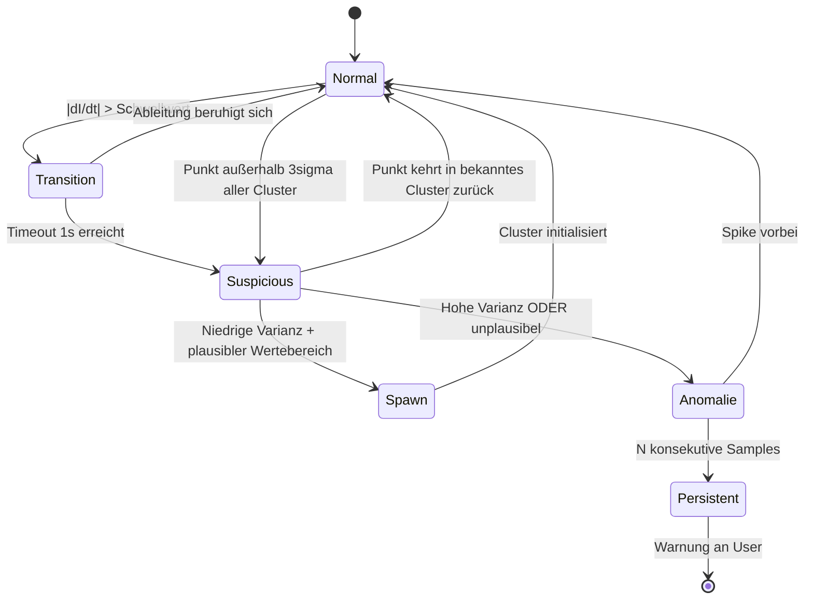

# Roadmap: KI-Bodenerkennung & Anomalie-Detection — Prototyp

Roadmap bis zum ersten funktionierenden Prototyp eines selbstlernenden Bodenerkennungs- und Wartungs-Diagnose-Systems für den Open-Source-Staubsauger.

## Prototyp-Scope

Der Prototyp ist bewusst eng geschnitten, um in 4–5 Wochen lieferbar zu sein:

- **Nur Generic-PWM-Builds** (LEDC-basiert wie aktuell)
- **Breadboard-INA226** als Stromsensor, kein PCB-Spin
- **Safety Schicht 1 via GPIO-Interrupt-Handler**, keine MCPWM-Migration
- **Xiaomi-G-Builds explizit ausgeschlossen**, weil RX-Parsing noch nicht existiert und kein RPM verfügbar ist
- **Sprache des Codes: Englisch**, konsistent zur bestehenden Codebase. Dieses Roadmap-Dokument bleibt Deutsch.

Alles weitere (MCPWM, PCB-Revision, Xiaomi-G-Support, Auto-Power-Anpassung, Daten-Spende) ist explizit v1.0 oder später — siehe Abschnitt "Out of Prototype Scope".

## Architektur-Übersicht

Das ML-System besteht aus drei aufeinander aufbauenden Schichten:

1. **Self-Calibration** — Beim ersten Boot misst das Gerät seinen eigenen Leerlauf-Baseline (RPM und Strom bei verschiedenen Duty-Stufen). Damit werden alle Sensordaten Build-unabhängig normalisiert.

2. **Distanzbasiertes inkrementelles Clustering** — Während des Saugens gruppiert das Gerät seine Sensordaten in Cluster. Cluster werden nur erzeugt, wenn neue Datenpunkte einen Distanz-Schwellwert zu allen bestehenden Centroiden überschreiten. Keine fixe Cluster-Zahl, keine Labels.

3. **Anomalie-Detection mit Suspicious-Buffer** — Punkte außerhalb der bekannten Cluster werden zunächst gepuffert und über Varianz und Plausibilität klassifiziert: stabile, plausible Werte führen zu einem neuen Cluster-Spawn, instabile oder physikalisch implausible zu einer Anomalie-Meldung.

Optional kann der Nutzer Cluster in der Web-UI benennen — nicht erforderlich für Funktion.

## Safety-Architektur (drei Schichten)

Die ML-Schicht darf niemals der einzige Schutz vor Hardware-Schaden sein.

**Schicht 1 — Hardware-nahe Reaktion (Mikrosekunden):**

Im Prototyp via **GPIO-Interrupt-Handler** mit hoher Priorität. INA226 ALERT-Pin geht auf einen freien GPIO mit Interrupt, der ISR zieht direkt den ProFet-Enable-Pin low. Reaktionszeit Mikrosekunden — für Motor-Schutz absolut ausreichend.

MCPWM-Fault-Trip-Mapping wird auf v1.0 verschoben zusammen mit der PCB-Revision (sub-Mikrosekunden, aber erfordert Migration `motor_generic_pwm/` von LEDC auf ESP-IDF-MCPWM, was eigene Risiken hat).

**Schicht 2 — Firmware-Loop (Millisekunden):**

Im Loop läuft vor allem ML-Code ein simpler Hard-Check: absolute Grenzwerte für Strom, Temperatur, Spannung. Werden sie überschritten → sofortiger `setMotorState(false)`. Grenzwerte sind pro Build fest hinterlegt und werden **nicht** aus dem ML-Modell abgeleitet. Die bestehende Temperatur-Cutoff-Logik in `main.cpp` ist exakt dieses Pattern — wird um Strom und Spannung erweitert.

**Schicht 3 — ML-Schicht (Sekunden):**

Anomalie-Erkennung wie unten beschrieben. Findet feinere Probleme (Filter zu, Bürste blockiert, Socke), die Hardware-Limits nicht auslösen.

Wenn ein ML-Bug das Modell crasht, schützen Schichten 1 und 2 die Hardware trotzdem.

## Backend-Dispatcher-Pattern

Die bestehende Firmware nutzt für Motor-Module ein Dispatcher-Pattern (`motor/motor.cpp` mit `motor_generic_pwm/` und `motor_xiaomi_g/` Backends hinter `MotorDriver`-vtable). Diesem Pattern folgen die neuen Module.

Im Prototyp wird das `current/`-Modul als Dispatcher angelegt, aber **nur das `current_ina226/`-Backend implementiert**. Das `current_xiaomi_g/`-Backend bleibt als Header-Stub für v1.0 reserviert. So entsteht keine Architektur-Schuld, nur eine verschobene Implementierung.

## Übergeordnete Design-Prinzipien

**Relative Schwellwerte, keine absoluten Werte.** Das System ist hardware-agnostisch. Alle Schwellwerte für Klassifikation, Spawn, Anomalie und Plausibilität werden aus der Kalibrierungs-Baseline berechnet (`Threshold = Baseline_Reference * Faktor`).

**Statische Speicher-Allokation.** Alle Puffer (Ringpuffer, Suspicious-Buffer, Cluster-Centroids) werden zur Compile-Zeit allokiert. Kein `new`/`malloc` im Loop.

**Watchdog-Timeouts als 3× nominale Update-Rate.** Jeder Sensor-Watchdog bekommt einen Timeout von mindestens 3× der nominellen Sample-Rate.

**NVS-Schreibvorgänge minimieren.** Adaption-State wird in RAM gehalten und nur bei Light-Sleep oder maximal alle 60 Minuten persistiert.

**NVS-Namespace-Trennung.** Calibration-Daten landen in einem eigenen Namespace `calib`, Cluster-Centroids in `floor`. Keine Kollision mit bestehenden `settings`-Keys.

## Anomalie-Pipeline State Machine

Während Transition wird weder Anomalie noch Spawn ausgelöst. Während Suspicious wird kein Cluster aktualisiert. Anomalie-Punkte werden vom Cluster-Update generell ausgeschlossen (Anomaly-Aware Learning).

## Annahmen

- 3-Personen-Team mit AI-assistiertem Coding
- Bestehende Firmware-Basis (ESP32-S3, WebSocket auf Port 81, NVS-Settings im Namespace `oshvac`, React-UI auf LittleFS)
- Breadboard-INA226 für Prototyp-Tests, kein PCB-Spin nötig
- Nur Generic-PWM-Motor

## Code-validierte Fakten (Stand Investigation)

Diese Punkte sind gegen die Codebase verifiziert und müssen die Phase-0-Planung konkret bestimmen:

- **INA226 ALERT → GPIO38** per Drahtverbindung direkt am ESP32-Pin. Keiner der 16 freien GPIOs ist auf den J5-Header geführt, daher Lötaktion zwingend
- **Tachometer-Update-Rate aktuell 5 Hz** (`UPDATE_INTERVAL = 200ms`). Muss auf ISR-Zeitstempel-Verfahren umgestellt werden für brauchbare Feature-Sampling-Rate
- **Kein Pre-Sleep-Hook im `power/`-Modul** vorhanden. Callback-Registry analog zu `RuntimeSettingsChangedCallback` muss eingeführt werden
- **Keine Firmware-Test-Infrastruktur**. Kein `[env:native]`, kein Unity/Doctest. Muss als Teil von Phase 0 / Phase 2 aufgesetzt werden
- **Heap-Monitoring nur via `ESP.getFreeHeap()`** — keine Fragmentation-Erkennung. `getMinFreeHeap()` und `getLargestFreeBlock()` ergänzen
- **Keine Loop-Timing-Instrumentierung** — schätzungsweise Sub-Millisekunde, aber muss gemessen werden
- **Pin-Mapping-Diskrepanzen** zwischen KiCad-Schematic und Firmware-Header bei UART (RX/TX-Labels) und I2C (SDA/SCL-Labels). Vor Hardware-Modifikationen verifizieren
- **WebSocket-Library** unterstützt `sendBIN()` mit 15 KB Frame-Limit (keine Send-Fragmentation), reicht für 160-Byte-Chunks weit aus
- **React-UI ist reiner Text/JSON-Client** ohne Binary-Frame-Handling. Python-Logger läuft daher als direkter WebSocket-Client vom Laptop, nicht via UI

## Phasenübersicht

| Phase | Inhalt | Dauer |
|-------|--------|-------|
| 0 | Setup, Kalibrierung, Safety-Foundation, Firmware-Foundation | 1,5 Wochen |
| 1 | Datensammlung (light) | 1 Woche |
| 2 | Modell-Pipeline (Clustering + Anomalie) | 1,5 Wochen |
| 3 | On-Device-Integration | 1 Woche |

**Gesamt:** 5 Wochen netto, 6 Wochen mit Puffer.

---

## Phase 0 — Setup, Kalibrierung, Safety- & Firmware-Foundation

**Ziel:** Hardware-Safety etabliert, Kalibrierung robust, normalisierte Features fließen sauber durch, Firmware-Infrastruktur für ML-Module bereit.

**Aufgaben — Verifikation & Infrastruktur:**

- **Pin-Mapping verifizieren** für UART (Schematic-Labels RX/TX vs. Firmware-Konstanten) und I2C (SDA/SCL). Aktuelle Kommunikation gegen Hardware testen, bevor weitere Mods erfolgen
- **Loop-Timing-Instrumentation**: `micros()`-basiertes Benchmarking pro Loop-Iteration einbauen, Durchschnitt und Worst-Case in Telemetrie
- **Heap-Monitoring** ergänzen: `ESP.getMinFreeHeap()` und `ESP.getLargestFreeBlock()` in `DisplayTelemetry` und WebSocket-JSON aufnehmen. Damit wird Fragmentation über Stunden sichtbar
- **Pre-Sleep-Callback-Registry im `power/`-Modul** einführen, analog zum bestehenden `RuntimeSettingsChangedCallback`-Pattern. Module registrieren sich via `registerPreSleepCallback(fn)`, `power.cpp` iteriert vor `esp_light_sleep_start()`. Notwendig für saubere NVS-Persistierung in Phase 3
- **PlatformIO `[env:native]` aufsetzen** als zweites Build-Target, gegen Desktop-GCC. Architektur-Constraint: ML-Module dürfen keine Arduino-Dependencies haben (Feature-Extraktor und ML-Logik operieren nur auf statischen Float-Vektoren). Foundation für Phase-2 Equivalence-Test-Harness

**Aufgaben — Sensorik:**

- **Tachometer-Upgrade**: Umstellung vom Count-over-Window-Verfahren (5 Hz) auf **ISR-Zeitstempel-Verfahren** (Pulse-to-Pulse-Intervall). Sauberer und skaliert besser zu höheren RPM. Effektive Sample-Rate steigt deutlich, nutzbar für 50-Hz-Feature-Sampling
- **Breadboard-INA226** an I2C-Bus (GPIO 8/9, auf J5-Header verfügbar) anschließen. **ALERT-Pin via Drahtverbindung an GPIO38** löten (nicht auf Header geführt, daher Lötaktion direkt am ESP32-Pin)
- **Modul `current/` als Dispatcher anlegen** mit zwei Backend-Stubs:
  - `current_ina226/` — voll implementiert (I2C-Treiber, ALERT-Konfiguration, GPIO38-Interrupt)
  - `current_xiaomi_g/` — Header-Stub als Platzhalter für v1.0

**Aufgaben — Safety:**

- **Safety Schicht 1: GPIO-Interrupt-Handler** auf GPIO38 mit hoher Priorität, zieht ProFet-Enable direkt low. Konfigurations-Schwellwert wird nach Kalibrierung gesetzt (z.B. 2× Nennstrom bei 100 % Duty)
- **Safety Schicht 2** aktivieren: absolute Strom-/Spannungs-Grenzwerte als Loop-Check, analog zur bestehenden Temperatur-Cutoff-Logik

**Aufgaben — Kalibrierung & Features:**

- **Kalibrierungs-Routine** (Modul `calibration/`): Motor durch Duty-Stufen 25/50/75/100 % rampen, Leerlauf-RPM und Leerlauf-Strom mitteln. **Plausibilitätsprüfung** integriert. Persistenz im neuen NVS-Namespace `calib`
- **Web-UI** um "Kalibrieren"-Seite ergänzen
- **Feature-Extraktor** in C++ (Arduino-frei!) und Python parallel implementieren. Statische Ringpuffer für Ableitungen über 100 ms und 500 ms Fenster. Normalisierung gegen Kalibrierungs-Baseline

**Aufgaben — Logging-Pipeline:**

- **Höher-getakteter Logging-Stream**: bestehendes WebSocket auf Port 81 um `broadcastBIN()`-Pfad erweitern. Effektiv 50 Hz, chunked als 5-Hz-Pakete à 10 Samples binär. Bleibt unter dem 15-KB-Frame-Limit
- **Python-Logger als direkter WebSocket-Client** vom Laptop, nicht via React-UI. UI-Binary-Support wird bewusst auf v1.0 verschoben
- **ML-Repo** aufsetzen (Notebooks, Datenformat, Dependencies)

**Gate Phase 0:**

- Pin-Mappings verifiziert, Diskrepanzen dokumentiert oder behoben
- Loop-Timing und Heap-Monitoring sind in Telemetrie sichtbar
- Pre-Sleep-Callback-Registry funktioniert
- `[env:native]` baut die ML-Module Arduino-frei
- Tachometer liefert hochfrequente Updates
- Hardware-Safety-Schicht 1 funktioniert: künstlicher Überstrom triggert Motor-Stopp via GPIO38-Interrupt (verifizierbar mit Logic Analyzer)
- Safety-Schicht 2 stoppt bei Verletzung absoluter Grenzwerte
- Gerät kalibriert sich, lehnt unplausible Kalibrierungen ab, persistiert in `calib`-Namespace
- Normalisierte Features inkl. Ableitungen werden über chunked Binary-WebSocket gebroadcastet
- Python-Logger speichert sauber in Parquet

---

## Phase 1 — Datensammlung (light)

**Ziel:** Genug echte Saug-Daten, um die Cluster-Sinnhaftigkeit lokal pro Gerät zu validieren. **Validiert wird Cluster-Qualität pro Wohnung, nicht Generalisierung** — letztere ist erst v1.0-Thema mit Community-Datensatz.

**Aufgaben:**

- 2–3 Stunden normales Saugen pro Wohnung, verteilt über mindestens 3 Wohnungen
- Verschiedene Akkustände abdecken
- Provozierte Fehlerszenarien: Bürste blockieren, Filter teilweise abdecken, Schlauch zuhalten, Übergangsphasen zwischen Bodentypen
- Leichtes Labeling für spätere Validierung
- Parallel: Erste Datenexploration im Notebook, prüfen ob distanzbasiertes Clustering sinnvolle Gruppen ergibt

**Gate Phase 1:**

- ~6–8 h Daten gesamt über 3 Wohnungen
- Cluster bilden visuell erkennbare Bodentyp-Gruppen
- Provozierte Fehler heben sich klar vom Normal-Korridor ab

---

## Phase 2 — Modell-Pipeline

**Ziel:** Algorithmen sind ausgewählt, parametrisiert, in Python wie in C++ funktional und verifiziert äquivalent.

**Aufgaben:**

- **Distanzbasiertes inkrementelles Clustering**: Cluster werden nur erzeugt bei Distanz-Schwellwert-Überschreitung zu allen bestehenden Centroiden. Zwischen 1 und 8 Cluster, sehr langsame Lernrate für Centroid-Adaption
- **Suspicious-Buffer-Mechanismus** für Spawn vs. Anomalie:
  - Statischer Ringpuffer (z.B. 2 Sekunden)
  - In Pufferphase: kein Update, keine Meldung
  - Nach Persistenz-Schwelle Klassifikation:
    - Niedrige Varianz UND plausibler Wertebereich (relativ zur Kalibrierung) → Spawn
    - Hohe Varianz ODER unplausibler Wertebereich → Anomalie
  - Optional UI-Bestätigung bei Spawn
- **Anomaly-Aware Learning**: Anomalie-Samples werden vom Cluster-Update ausgeschlossen
- **Transitions-Gate mit 1-Sekunden-Timeout**: Bei hohen Ableitungen Anomalie-Detection unterdrücken, aber maximal 1 Sekunde
- **Bounding-Box mit asymmetrischer Korridor-Erweiterung**: Bei Drift-Anschlag friert Cluster ein, Erkennungs-Korridor erweitert sich in Drift-Richtung (+6σ), UI spielt Re-Kalibrierungs-Empfehlung aus
- **Anomalie-Persistenz-Schwelle**: Anomalie wird erst nach N konsekutiven Samples gemeldet
- **Validierung auf gesammelten Daten**: Cluster vs. Labels, Anomalie-Trefferquote, keine False-Positives bei Übergängen
- **Hyperparameter festklopfen**: Distanz-Schwellwert, Lern-Rate, Persistenz-Schwellen, dI/dt-Schwellwert, Bounding-Box-Radius, Plausibilitäts-Faktoren
- **C++-Port** der Algorithmen, statische Allokation, deterministisch, **Arduino-frei** (operiert nur auf statischen Float-Vektoren)
- **Python↔C++ Equivalence Test Harness**: dockt am in Phase 0 aufgesetzten `[env:native]` an. C++-CLI-Tool liest Feature-Vektoren aus CSV, Python-Skript füttert beide Implementierungen mit identischen Eingaben, Vergleich via `numpy.allclose()` mit definierter Floating-Point-Toleranz

**Gate Phase 2:**

- Python-Pipeline klassifiziert Test-Daten konsistent
- Spawn-Mechanismus erzeugt Cluster für stabile Böden, nicht für Anomalien
- Anomalie-Detection erkennt provozierte Fehler ohne False-Positives bei Übergängen
- Bounding-Box-Mechanismus verhält sich korrekt
- Equivalence-Harness bestätigt C++↔Python-Übereinstimmung

---

## Phase 3 — On-Device-Integration

**Ziel:** Komplettes System läuft on-device über eine Saug-Session.

**Aufgaben:**

- Modul `floor_detection/` in Firmware integrieren, läuft im Loop. Intervall basierend auf in Phase 0 gemessenem Loop-Timing-Budget (initial 250 ms, anpassen falls Inferenz-Zeit es zulässt oder erfordert)
- Modul `anomaly/` mit Persistenz-Schwelle und LED-/Display-Warnung
- Aktuelle Cluster-ID und Anomalie-Status in `DisplayTelemetry` und WebSocket-JSON aufnehmen
- **NVS-Persistenz-Strategie**:
  - Cluster-Centroids und Adaption-State in RAM
  - Persistierung im `floor`-Namespace via Pre-Sleep-Callback (in Phase 0 eingeführt)
  - Backup alle 60 Minuten als Power-Loss-Schutz
- Web-UI: Cluster-Nutzungsstatistik, Eingabefeld zum Benennen, Re-Kalibrierungs-Empfehlung bei Bounding-Box, Spawn-Bestätigungs-Dialog
- Benchmark: Inferenzzeit pro Iteration, Heap (konstant über Zeit), kein Memory-Leak
- **1-Stunden-Dauerlauf**: kein Crash, kein Heap-Wachstum
- Live-Test: Wohnung durchsaugen, Cluster-Wechsel beim Bodentyp-Wechsel, Bürste-Blockade triggert Warnung, normaler Übergang nicht

**Optionale Phase-3-Optimierung (falls Inferenzzeit klemmt):** ML-Update auf Core 0 via `xTaskCreatePinnedToCore`, Motor-Control bleibt auf Core 1. Direkte Antwort auf das Performance-Risiko, aber nur wenn Benchmark-Daten es erfordern.

**Gate Phase 3 (= Prototyp fertig):**

- Self-Calibration funktioniert beim ersten Boot
- Distanzbasiertes Clustering läuft stabil über eine Saug-Session
- Anomalie-Detection erkennt Fehler ohne False-Positives bei Übergängen
- Hardware-Safety-Schichten 1 und 2 greifen bei künstlichen Fehlerzuständen
- 1 Stunde Dauerlauf, Heap konstant

---

## Out of Prototype Scope (v1.0+)

Bewusst aus dem Prototyp ausgeschlossen, um den Scope kontrolliert zu halten:

- **Xiaomi-G-Support** — erfordert RX-Frame-Parsing (existiert nicht), Reverse-Engineering oder Doku des ESC-Protokolls, eventuell PCB-Anpassung falls RX-Leitung nicht verdrahtet. Wird als komplettes eigenes Workstream behandelt
- **MCPWM-Migration** für Sub-Mikrosekunden Safety Schicht 1 — Paradigmenwechsel weg von Arduino-LEDC zu ESP-IDF-Peripheral-Level. Kommt zusammen mit der PCB-Revision
- **PCB-Revision** mit integriertem INA226, geroutetem ALERT → MCPWM-Fault-Input, Footprint für optionalen IMU
- **Auto-Power-Anpassung**: Erkennung Teppich → Duty hoch, Hartboden → runter, mit Hysterese
- **Filter-Health-Score** basierend auf Drift des Normal-Korridors über Zeit
- **Daten-Spende-Pfad** für gemeinsamen OSS-Datensatz, später Cold-Start-Modell
- **IMU als zusätzliches Sensor-Backend** falls Phase 1 zeigt, dass Strom + RPM nicht reichen
- **Englische Übersetzung** dieses Dokuments für die OSS-Community
- **React-UI Binary-Frame-Support** für Live-Visualisierung des Sensor-Streams im Browser (Prototyp nutzt Python-Logger)
- **Pin-Mapping-Diskrepanzen** in Schematic/Firmware sauber harmonisieren (UART-Labels, I2C-Labels) im Zuge der PCB-Revision

## Risikohinweise

- **Wenn das in Phase 0 gemessene Loop-Timing zeigt, dass die Iteration knapp am Budget ist**: ML-Inferenz von vornherein auf Core 0 via `xTaskCreatePinnedToCore` verlagern, statt es als Phase-3-Optimierung zu behandeln
- **Wenn das ISR-Zeitstempel-Verfahren am Tachometer auf bestimmten Motoren ungewöhnliches Jitter zeigt**: Fallback auf 20-ms-Count-over-Window-Verfahren, dafür verrauschter, aber robust
- **Wenn die Pin-Mapping-Verifikation Konflikte aufdeckt** (z.B. OLED kommuniziert tatsächlich auf vertauschten Pins): Verzögerung um 0,5–1 Tag plus eventuell Firmware-Korrektur
- **Wenn `[env:native]` Konflikte mit Arduino-Dependencies in Nachbar-Modulen produziert**: Striktes Trennen via Header-Interface zwischen Sensor-Layer und ML-Layer
- **Wenn in Phase 1 die Cluster sich nicht sauber trennen lassen**: IMU als zusätzliches Backend-Modul am gemeinsamen I2C-Bus. Eine Woche extra
- **Wenn distanzbasierter Spawn zu konservativ ist**: Schwellwert anpassen oder Spawn nach kürzerer Persistenz erlauben mit zwingender UI-Bestätigung
- **Wenn der Logging-Stream trotz Chunking WiFi sättigt**: Sample-Rate temporär reduzieren oder im seltenen Fall auf separaten Raw-TCP-Socket umsteigen
- **Wenn die GPIO38-Drahtverbindung mechanisch unzuverlässig wird**: Festere mechanische Lösung (winziges Aufsteck-Board oder direkter Solder-to-PCB) — für Prototyp-Phase aber unproblematisch
