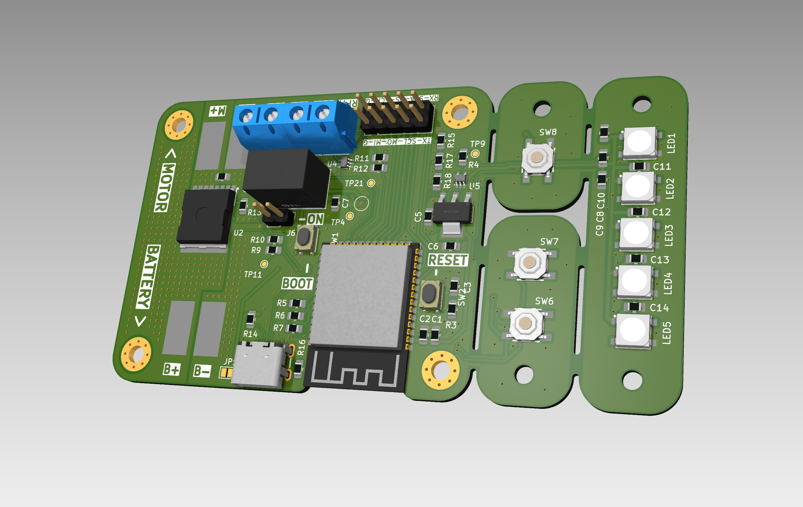
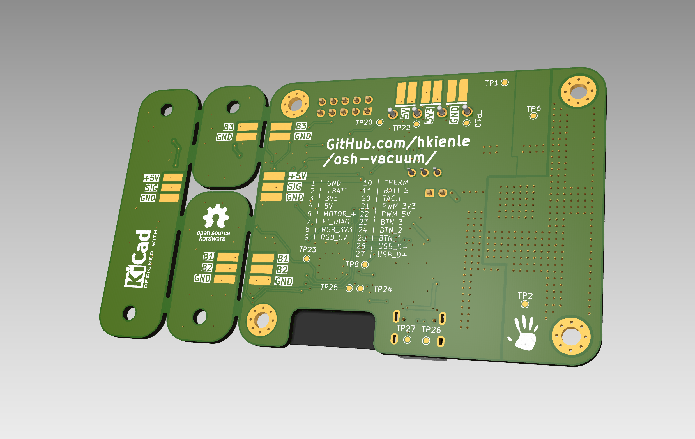
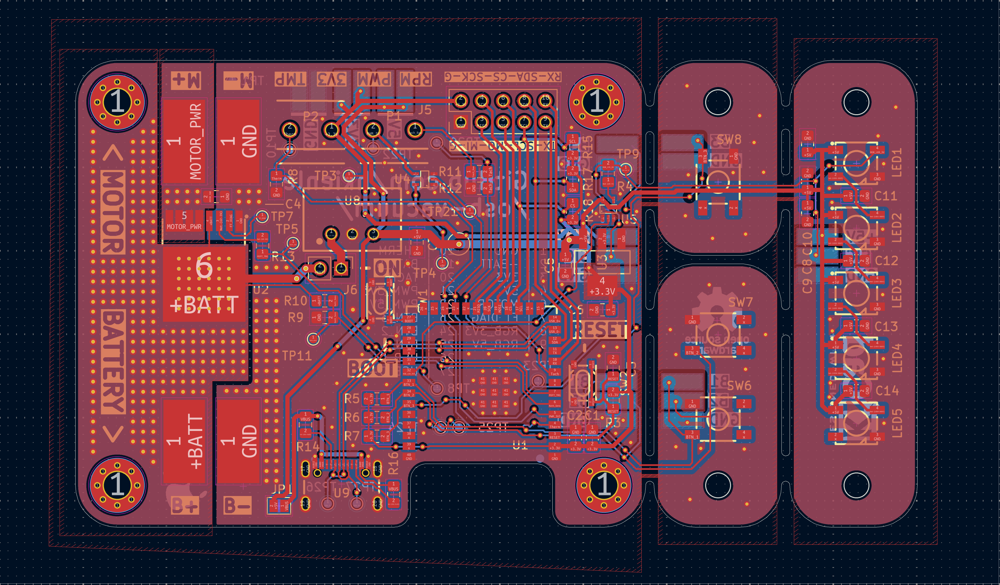

# PCB Bench Prototype

**Status: Untested** - This board is currently in the benchtop prototype phase of the Open Source Vacuum Cleaner project and has not yet been tested.

## Overview

This PCB is designed to control a high RPM impeller for vacuum machines. It provides comprehensive control and monitoring capabilities with modern connectivity options.

The design features break-off sections that allow users to build their own vacuum cleaner in whichever shape they like. These break-off sections enable flexible placement of LEDs and buttons to suit various form factors and user preferences.

## Features

- **Connectivity**
  - BLE (Bluetooth Low Energy)
  - WiFi connectivity
  
- **Power Management**
  - USB-C connector for programming
  - Voltage regulation from 15-32V down to 5V and 3.3V
  - Battery voltage monitoring (reads voltage of connected battery)
  
- **User Interface**
  - 5 RGB LEDs (WS2812B)
  - 3 customizable buttons
  
- **Motor Control & Monitoring**
  - Automotive ProFet by Infineon for high-side switching (required for ESC control, replacing classic MOSFETs)
  - Level-shifted 3.3V and 5V PWM output
  - Voltage-divided input for 5V tachometer signal
  - 10kΩ thermistor reading capability
  
- **Expansion**
  - All unused and safe GPIOs are broken out
  - I2C, SPI, and UART interfaces available

## Bill of Materials (BOM)

| Designator | Footprint | Quantity | Value | LCSC Part # |
|------------|-----------|----------|-------|-------------|
| C1, C7, C8, C9 | 0805 | 4 | 22µF | - |
| C10, C11, C12, C13, C14, C2, C5 | 0805 | 7 | 0.1µF | - |
| C3 | 0805 | 1 | 1µF | - |
| C4 | 0805 | 1 | 10nF | - |
| C6 | 0805 | 1 | 10µF | - |
| LED1, LED2, LED3, LED4, LED5 | LED-SMD_4P-L5.0-W5.0-TL-1 | 5 | WS2812B-V5/W | C2874885 |
| R10 | 0805 | 1 | 330kΩ | - |
| R11 | 0805 | 1 | 33kΩ | - |
| R12 | 0805 | 1 | 56kΩ | - |
| R13 | 0805 | 1 | 4.7kΩ | - |
| R14, R16 | 0805 | 2 | 5.1kΩ | - |
| R15, R17, R18, R3, R5, R6, R7, R8 | 0805 | 8 | 10kΩ | - |
| R4 | 0805 | 1 | 220Ω | - |
| R9 | 0805 | 1 | 22kΩ | - |
| SW1, SW2 | SW-SMD_4P-L4.2-W3.2-P2.15-LS4.6 | 2 | RKB2SJK250SMTRLFS | C2927789 |
| SW6, SW7, SW8 | KEY-SMD_4P-L5.2-W5.2-P3.7-LS6.4-TL | 3 | TS-1076S-A7B3 | C492950 |
| U1 | WIRELM-SMD_ESP32-S3-WROOM-1 | 1 | ESP32-S3-WROOM-1(N16R2) | C2913205 |
| U2 | PG-HSOF-8_L10.4-W9.8-BTH500151LUAAUMA1 | 1 | BTH500151LUAAUMA1 | C36571656 |
| U3 | SOT-223-4_L6.5-W3.5-P2.30-LS7.0-BR | 1 | LD1117S33CTR | C35879 |
| U4, U5 | SC-70-5_L2.0-W1.3-P0.65-LS2.1-BL | 2 | SN74AHCT1G125DCKR | C350557 |
| U8 | PWRM-TH_L11.7-W7.5_TSR1-2450 | 1 | TSR 1-2450_C6886877 | C6886877 |
| U9 | USB-SMD_TYPE-C16PIN-1 | 1 | 12402012E212A | C5150972 |

## Images

### Front View

### Back View

### PCB Layout

